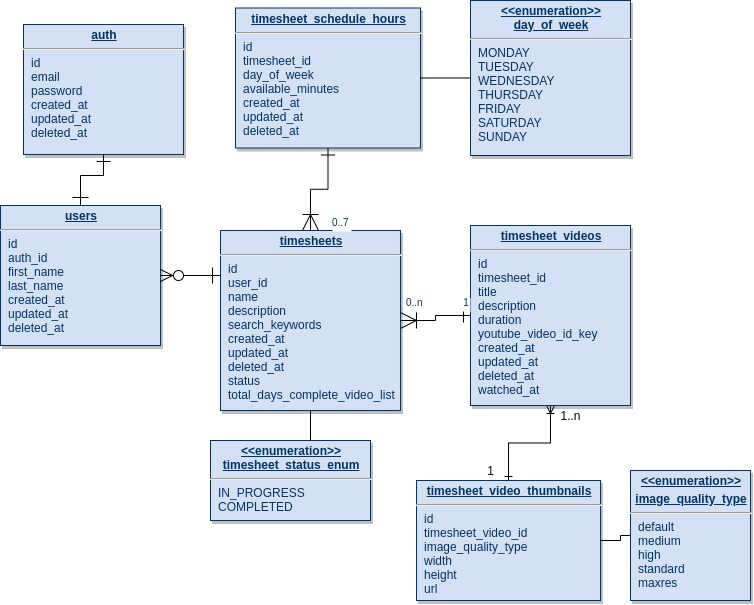
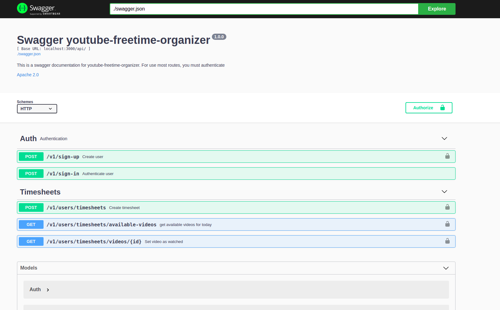

# Youtube freetime organizer


## Table of Contents

<!-- vscode-markdown-toc -->
0. [Requirements](#Requirements)
1. [Intro](#Intro)
2. [Challenge](#Intro)
3. [Installation](#Installation)
    1. [Node](#Node)
    2. [Makefile](#Makefile)
    3. [Docker](#Docker)
4. [Usage](#Usage)
5. [Database](#Database)
6. [Swagger](#Swagger)
7. [Tests](#Tests)
8. [License](#License)


## 0. <a name='Requirements'></a>Requirements

Before of all take a look at .env.sample file which contains the necessary keys for the application works properly.

Create a file name .env and set the keys from .env.sample.

## 1. <a name='Intro'></a>Intro

The youtube-freetime-organizer is an api used to organize the freetime that can be used to watch videos on youtube. Using this api you will be able to create a schedule based in minutes available in week day and regarding that it is possible to search and show youtube videos and create a queue list of videos to be displayed in search order.

### 1.2. Database architecture



## 3. 📦 <a name='Installation'></a>Installation


### 3.1 Node
```
  npm install
  npm start
```

### 3.2 Makefile
```
    make production
```
### 3.3 Docker

#### Dependencies

    You need to have a docker and docker-compose installed in your machine.

```
    docker-compose up
```

## 4. 📖 <a name='Usage'></a>Usage

At very first beginning it is necessary to create a .env file to the application work properly. 

You can take a look at .env.sample where you will find the keys necessary to run the project.

The integration with youtube it might work only on production mode, but it is necessary a key for it at .env called YOUTUBE_SECRET_KEY.

You can control how many videos you want to be considered in a searching setting the key: MAX_ITEMS_VIDEO_SEARCH.

It is required to set the database configurations as well and you can run an instance of PostgreSQL from docker changing few parameters at makefile.

To run the production mode just:
```
    npm start
```

You can also teste the application in dev mode which a mock file with the same response structure from youtube, where it was used the keywords for search: 'best practices nodejs'.

You can run a dev mode as bellow:

```
    npm run dev
```

## 5. 📖 <a name='Database'></a>Database

The database used is PostgreSQL and it was used an ORM called sequelize.js to integrate Node.js with PostgreSQL.


The database initialization it will pretty much create the database, run the migrations and run all seeds:

### 5.1 Node

```
  npm run build-database
```

## 6. 📄 <a name='Swagger'></a>Swagger

You can take a look in everything which has in the api by swagger.

To generate the most updated swagger.json file at public folder you need to run the command:

```
  npm run swagger-json
```

You must have installed Docker and you can use the command:

```
  make swaggerui
```

You can access the swagger-ui from http://localhost:8085




## 7. 📄 <a name='Tests'></a>Tests

You can run the applications tests with

```
  npm test
```

## 8. 📄 <a name='License'></a>License
Simple Object Handler is [MIT licensed](./LICENSE).